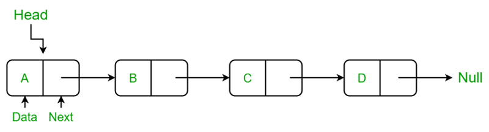

# 자료구조(Data Structure)
## 리스트(List)
### 배열(Array)
- 정의 : 동일한 데이터 타입의 요소들을 순차적으로 저장하는 선형 데이터 구조
- 특징   
    - 동일한 데이터 타입의 요소들로만 구성
    - 요소들이 순차적으로 저장 - 메모리 상에서 연속된 공간에 데이터를 배치
    - 인덱스를 기반으로 배열의 요소에 접근
#### 고정 크기 배열 (Fixed-size Array)	
- 정의 : 미리 정의된 크기만큼의 메모리를 할당받아 동적으로 크기를 변경할 수 없는 배열
- 특징 : 선언시 단 한번만 메모리를 할당받음
- 장점 
    - 배열의 크기가 고정되어 있기 때문에 각 인덱스에 해당하는 메모리 주소를 빠르게 계산하여 접근 가능
    - 메모리 관리가 상대적으로 단순하고 일정한 성능을 보장
- 단점
    - 크기가 고정되어 있기 때문에 배열의 크기보다 데이터의 양이 적으면 메모리를 낭비하게될 가능성이 있음
    - 선언된 배열의 크기보다 더 많은 데이터를 저장해야 할 경우 새로운 배열을 만들어 데이터를 복사해야 함
- 예시
    <details><summary>C언어에서의 고정 크기 배열</summary>

    ```C
    int arr[5]; //고정 크기 배열 선언
    arr[0] = 10; //0번 인덱스에 10 할당
    ```
    </details>


#### 동적 배열 (Dynamic Array)
- 정의 : 배열의 크기가 동적으로 변화할 수 있는 배열
- 특징
    - 크기가 변경될 때 마다 새로운 메모리 블록을 할당하고, 기존 배열의 데이터를 새로운 배열로 복사
- 장점
    -  크기가 동적으로 변화하므로 선언시 필요한 크기를 예측할 필요가 없음
    -  데이터의 양에 따라 유동적으로 배열의 크기를 변경하여 메모리 낭비를 줄임
- 단점
    -  배열 크기가 늘어날 때마다 메모리 재할당과 복사가 발생하여 성능에 영향을 줄 수 있음
- 예시
    <details><summary>C언어에서의 동적 배열</summary>

    ```C
    int* arr = (int*)malloc(sizeof(int) * 10); //동적 배열, 크기 10 할당
    free(arr) //메모리 반납
    ```
    </details>

### 연결 리스트 (Linked List)	
- 정의 : 각 노드가 데이터와 포인터를 가지고 한 줄로 연결되어 있는 방식으로 데이터를 저장하는 선형 자료 구조
- 특징
    -  노드가 추가되거나 제거되면서 크기가 동적으로 변화할 수 있음
    -  각 노드가 메모리의 다른 위치에 저장되며, 노드들이 포인터를 통해 연결되어 있음
    -  삽입 삭제시 포인터만 변경하면 되어 배열보다 효율적이나 특정 요소를 찾을 때 전체를 순회해야해 검색 시간이 배열보다 느림
#### 단일 연결 리스트 (Singly-Linked List)
- 정의 : 각 노드가 데이터와 다음 노드를 가리키는 포인터를 가지고 일렬로 연결되어 있는 리스트
- 특징
    -  각 노드의 포인터는 다음 노드만을 가리킴
- 장점
    -  연결 리스트의 장점을 가지나 단일 연결 리스트만의 장점은 없음
- 단점
    -  특정 노드에 접근하기 위해서 헤드부터 원하는 노드까지 탐색해야 함
    -  역방향 탐색이 불가능함
- 예시
    <details><summary>단일 연결 리스트 예시</summary>

       
    Image source : GeeksforGeeks

    </details>

#### 이중 연결 리스트 (Doubly-Linked List)		
- 정의 : 각 노드가 데이터와 이전과 다음 노드를 가리키는 포인터를 가지고 일렬로 연결되어 있는 리스트
- 특징
    -  각 노드의 포인터가 이전 노드와 다음 노드를 가리키는 포인터를 가지고 있음
- 장점
    -  양방향 탐색이 가능함
    -  단일 연결 리스트에 비해 노드의 이전 노드를 탐색하고 삭제하기가 용이
    -  헤드 노드와 테일 노드의 삽입 삭제가 용이
- 단점
    -  단일 연결 리스트에 비해 포인터를 하나 더 사용하여 메모리를 더 많이 사용
    -  단일 연결 리스트보다 포인터 관리가 복잡
- 예시


#### 원형 연결 리스트 (Circular-Linked List)		
- 정의 : 리스트의 마지막 노드가 헤드 노드를 가리켜서 노드들이 원형으로 연결되어 있는 리스트
- 특징
    -  단일 연결 리스트와 이중 연결 리스트 모두에서 구현이 가능
    -  마지막 노드의 포인터가 헤드 노드를 가리켜 리스트 전체가 순환가능한 구
- 장점
    -  리스트의 끝에서 처음 노드로 이동할 수 있어 순환 작업에 유리(ex: Round-Robin 스케줄링)
    -  어느 노드에서든 탐색을 시작하여 전체 탐색이 가능
- 단점
    -  순환 구조로 인해 종료 조건을 명확히 하지 않으면 무한 루프에 빠질 위험이 있음
- 예시


#### 다중 연결 리스트 (Multi-Linked List)
- 정의 : 앞의 연결 리스트들과 달리 단방향, 양방향으로 연결된 것이 아니라 각 노드가 여러개의 포인터를 가져 포인터들을 통해 여러 노드에 연결되어 있는 리스트
- 특징
    -  각 노드가 여러개의 포인터를 가지며 각각 다른 방향이나 리스트를 가리킬 수 있음
    -  행렬과 같은 다차원 데이터를 연결 리스트로 표현할 때 사용 가능
- 장점
    -  데이터가 여러 연결 리스트의 노드로 포함될 수 있어 복잡한 관계 표현 가능
    -  여러 방향으로 연결이 가능하여 데이터 탐색이나 관계 표현이 유연
- 단점
    - 다수의 포인터를 관리해야 하므로 삽입, 삭제, 탐색의 구현이 매우 복잡하고 포인터 관리가 부담스러움
    - 다수의 포인터를 사용하므로 타 연결 리스트들에 비해 메모리를 더 많이 사용
- 예시
  
---
## 스택
- 정의 : 한쪽 끝에서만 데이터를 넣고 뺄 수 있는 제한된 접근 형태를 가진 LIFO형태의 선형 자료구조
- 특징
    -  처음 들어온 데이터가 제일 아래 놓이고 그 위로 데이터가 쌓이는 형태를 가짐
    -  데이터의 삽입, 삭제가 스택의 제일 위에 위치한 데이터를 가리키는 Top에서 이루어짐
- 예시
    <details><summary></summary>


    </details>

### 배열 기반 스택 (Array-based Stack)			
- 정의 : 배열을 이용하여 스택 자료 구조를 구현한 형태
- 특징
    -  일반적으로 배열의 크기에 따라 스택의 크기가 고정되어있음
    -  배열의 인덱스를 사용하여 특정 위치의 데이터에 접근 가능
- 장점
    -  배열 구조를 이용하므로 구현이 간단함
    -  데이터가 메모리에 연속적으로 저장되므로 캐시 활용이 유리하고 속도가 빠름
- 단점
    -  고정 크기 배열을 사용한다면 배열 크기를 초과할 때 스택 오버플로우가 발생
    -  스택의 크기를 사전에 예측하기 어렵다면 메모리 낭비나 부족이 발생할 수 있음
- 예시


### 연결 리스트 기반 스택 (Linked List-based Stack)	
- 정의 : 연결 리스트를 이용하여 스택 자료 구조를 구현한 형태
- 특징
    -  연결 리스트를 사용하므로 동적 크기를 가짐
    -  연결 리스트의 헤드 노드가 Top 노드로 작동
- 장점
    -  연결 리스트를 사용하여 스택의 크기를 사전에 정할 필요가 없으며 유동적으로 확장 가능
    -  메모리의 낭비가 없음
    -  기타 자료구조로 확장이 용이함
- 단점
    -  각 노드에 포인터가 포함되어 있어 배열 기반 스택에 비해 메모리 사용량이 많음
    -  배열 기반 스택에 비해 구현이 복잡
    -  메모리가 연속적으로 할당되지 않아 배열 기반에 비해 캐시 성능이 떨어짐
    -  특정 위치에 있는 데이터를 참조하기 위해 Top부터 순차적으로 탐색해야해서 시간이 오래 걸림
- 예시


### 최소값/최대값 추적 스택 (Min/Max Stack)			
- 정의 : 스택 내에서 삽입과 삭제를 수행할 때 현재 스택의 최소값과 최대값을 추적할 수 있도록 설계된 스택
- 특징
    -  스택에 값을 삽입하거나 삭제할 때 스택 내의 최소값과 최대값을 추적함
    -  보조 스택을 사용하여 최소값과 최대값을 저장하여 조회가 빠름
- 장점
    -  최소값과 최대값을 **O(1)** 의 시간 복잡도로 조회 가능
- 단점
    -  최소값과 최대값을 추적하기 위해 보조 스택을 사용하여 메모리 사용량이 많음
    -  삽입, 삭제시 보조 스택도 관리해야 하므로 구현이 복잡
- 예시

---
## 큐 (Queue)
- 정의 : 한쪽 끝에서만 삽입이 이루어지고, 다른 한쪽 끝에서는 삭제가 이루어지는 FIFO 자료구조
- 특징
    -  앞(front)와 뒤(rear) 포인터를 가지고 삽입과 삭제 연산 수행
    -  주요 연산
       -  Enqueue - 데이터를 rear에 삽입
       -  Dequeue - 데이터를 front에서 삭제하고 반환
       -  peek - front에 있는 데이터를 반환
### 배열 기반 큐 (Array-based Queue)
- 정의 : 배열을 이용하여 큐를 구현하는 방식
- 특징
    -  배열을 이용하여 고정 크기를 가짐
    -  인덱스를 통해 데이터에 접근 가능
- 장점
    -  연속된 메모리 공간에 데이터를 저장해 접근이 빠름
- 단점
    -  크기가 정해져 있어 메모리 낭비 혹은 크기 초과 문제가 발생할 수 있음
    -  Dequeue를 반복할수록 front가 점점 뒤로 이동해 앞의 메모리 공간이 비어있는 상태로 방치될 수 있어 데이터 이동을 구현해야 함
- 예시


### 순환 큐 (Circular Queue)			
- 정의 : 배열 기반 큐에서 발생할 수 있는 메모리 낭비 문제를 해결하기 위해 원형 구조로 배열의 끝에 도달하면 다시 처음으로 돌아가 데이터를 삽입하거나 제거할 수 있도록 만든 큐
- 특징
    -  배열의 앞과 끝이 연결되어 배열의 끝에 도달하면 앞부터 다시 시작
- 장점
    -  Dequeue되어 빈 공간을 다시 사용할 수 있어 따로 데이터 이동을 구현할 필요가 없음
- 단점
    -  front와 rear가 배열의 끝에 도달하면 다시 앞으로 가게 만들어야 해서 배열 기반 큐에 비해 구현이 복잡
- 예시


### 연결 리스트 기반 큐 (Linked List-based Queue)			
- 정의 : 연결 리스트를 기반으로 큐를 구현하는 방식
- 특징
    -  연결 리스트 기반이기 때문에 큐의 크기를 동적으로 조정 가능
- 장점
    -  큐의 크기를 동적으로 조정 가능해 메모리 부족이나 낭비 문제가 해결됨
- 단점
    -  포인터 조작이 필요해 배열 기반 큐에 비해 연산 속도가 느림
    -  노드의 메모리 할당과 해제 비용이 계속해서 발생하고 메모리를 관리해야함
- 예시


### 우선순위 큐 (Priority Queue)			
- 정의 : 일반적인 큐와 달리 우선순위(priority)에 따라 데이터 처리 순서를 결정하는 큐
- 특징
    -  우선순위 값에 따라 큐 내부에서 데이터가 정렬됨
    -  우선순위가 높은 데이터부터 dequeue됨
    -  동일한 우선순위를 가지는 경우에는 FIFO를 따름


#### 배열 기반 우선순위 큐		
- 정의 : 배열을 사용하여 우선순위 큐를 구현한 형태
- 특징
    -  배열을 우선순위 순서 정렬 여부에 따라 두가지 방법으로 나뉨
    -  삽입과 삭제 연산의 효율성이 배열 정렬 여부에 따라 달라짐
- 장점
    -  배열을 기반으로 하기 때문에 구현이 간단
- 단점
    -  정렬되지 않은 배열 - dequeue시 우선순위를 찾는데 **O(n)** 의 시간이 필요
    -  정렬된 배열 - enqueue시 우선순위 정렬을 유지하기 위해 **O(n)** 의 시간이 필요
- 예시


#### 힙 기반 우선순위 큐
- 정의 : 힙 자료구조를 사용하여 우선순위 큐를 구현한 형태
- 특징
    -  이진 트리 형태를 가짐
    -  최대 힙(Max-Heap)의 경우에는 부모 노드의 우선순위 값이 자식 노드보다 크거나 같음
    -  최소 힙(Min-Heap)의 경우에는 부모 노드의 우선순위 값이 자식 노드보다 작거나 같음
- 장점
    -  euqueue와 dequeue 연산이 모두 **O(log n)** 의 시간 복잡도를 가져 효율적
    -  삽입과 삭제시 힙 재구성을 통해 정렬을 유지하여 추가 정렬 작업이 불필요
- 단점
    -  힙 자료구조를 기반으로 하기 때문에 구현이 복잡
    -  인덱스를 사용하지 않기 때문에 특정 요소에 직접 접근하는데 비효율적
- 예시


## 데크	(Deque, Double-Ended Queue)
- 정의 : 양쪽 끝에서 데이터 처리가 가능한 큐
- 특징
    -  삽입과 삭제 연산이 양쪽 끝에서 모두 가능
    -  큐와 스택의 성질을 포함하여 FIFO와 LIFO의 특성을 모두 가짐
  

### 배열 기반 데크 (Array-based Deque)			
- 정의 : 배열을 사용하여 데크를 구현한 형태
- 특징
    -  배열의 양 끝이 연결된 원형 구조(Circular Array)로 설계되어 배열 끝을 넘어가면 처음으로 돌아가서 빈 공간부터 연산
- 장점
    -  양쪽 끝에서의 삽입과 삭제 연산이 **O(1)** 으로 효율적
    -  원형 배열을 사용하기 때문에 고정된 메모리 내에서 효율적으로 동작
- 단점
    -  배열은 연속된 메모리 공간이 필요해 메모리 부족 상황에서 유언성이 떨어짐
- 예시


### 연결 리스트 기반 데크 (Linked List-based Deque)			
- 정의 : 이중 연결 리스트를 사용하여 데크를 구현한 형태
- 특징
    -  이중 연결 리스트 기반이기 때문에 크기를 미리 설정하지 않아도 됨
    -  배열 기반 데크보다 구조적으로 유연하고 크기 제한이 없음
- 장점
    -  필요할 때만 메모리를 동적으로 할당하여 메모리 낭비를 줄일 수 있음
    -  양쪽 끝에서의 삽입과 삭제가 **O(1)** 으로 효율적
- 단점
    -  각 노드가 데이터와 포인터를 저장해야하므로 배열 기반 데크에 비해 메모리 공간이 많이 필요함
    -  특정 인덱스의 데이터에 접근하려면 순차 탐색이 필요하여 **O(n)** 의 시간 복잡도가 필요함
- 예시


## 트리				
### 트리 (Tree)		
- 정의:
- 특징:	
#### 일반 트리		
- 정의 :
- 특징
- 장점
- 단점
- 예시
#### Left-child-right-sibling 트리		
- 정의 :
- 특징
- 장점
- 단점
- 예시
### 트리 순회
- 정의:
- 특징:
#### 전위 순회 (Pre-order Traversal)		
#### 중위 순회 (In-order Traversal)		
#### 후위 순회 (Post-order Traversal)		
#### 레벨 순회 (Level-order Traversal)		
### 이진 트리 (Binary Tree)			
- 정의:
- 특징:
#### 포화 이진 트리 (Full Binary Tree)		
#### 완전 이진 트리 (Complete Binary Tree)		
#### 경사 트리 (Skewed Tree)		
#### 수식 트리 (Expression Tree)		
### 이진 탐색 트리 (Binary Search Tree)			
- 정의:
- 특징:
#### 균형 이진 탐색 트리 (Balanced BST)		
##### AVL 트리 (AVL Tree)	
##### 레드-블랙 트리 (Red-Black Tree)	
##### Splay Tree	
#### B 트리 계열		
##### B 트리 (B-Tree)	
##### B+ 트리 (B+ Tree)	
##### B* 트리 (B* Tree)	
### 힙 (Heap)	
- 정의:
- 특징:		
#### 최대 힙 (Max-Heap)		
#### 최소 힙 (Min-Heap)		
#### 이진 힙 (Binary Heap)		
#### 피보나치 힙 (Fibonacci Heap)		
#### 이진 트리 기반 힙		
### 분리 집합 (Disjoint Set)	
- 정의:
- 특징:		
#### Union-Find 알고리즘		
#### 경로 압축 및 크기 조정		
## 그래프				
### 그래프 (Graph)	
- 정의:
- 특징:		
#### 방향 그래프 (Directed Graph)		
#### 무방향 그래프 (Undirected Graph)		
#### 가중 그래프 (Weighted Graph)		
#### 비가중 그래프 (Unweighted Graph)		
### 그래프 표현 방식			
- 정의:
- 특징:
#### 인접 행렬 (Adjacency Matrix)		
#### 인접 리스트 (Adjacency List)		
### 그래프 순회			
- 정의:
- 특징:
#### 너비 우선 탐색 (Breadth-First Search, BFS)		
#### 깊이 우선 탐색 (Depth-First Search, DFS)		
### 최단 경로 알고리즘		
- 정의:
- 특징:	
#### 다익스트라 알고리즘 (Dijkstra's Algorithm)		
#### 벨만-포드 알고리즘 (Bellman-Ford Algorithm)		
#### 플로이드-워셜 알고리즘 (Floyd-Warshall Algorithm)		
### 최소 신장 트리 (Minimum Spanning Tree)		
- 정의:
- 특징:	
#### 크루스칼 알고리즘 (Kruskal's Algorithm)		
#### 프림 알고리즘 (Prim's Algorithm)		
### 위상 정렬 (Topological Sorting)			
- 정의:
- 특징:
### 강결합 요소 탐색 (Strongly Connected Components)			
- 정의:
- 특징:
### 이분 그래프 탐색 (Bipartite Graph Check)			
- 정의:
- 특징:
## 해시
- 정의:
- 특징:				
### 해시 테이블 (Hash Table)			
### 해시 함수 (Hash Function)			
### 충돌 처리 (Collision Handling)			
#### 개방 주소법 (Open Addressing)		
#### 체이닝 (Chaining)		
### 동적 크기 조정 (Dynamic Resizing)			
### 블룸 필터 (Bloom Filter)			